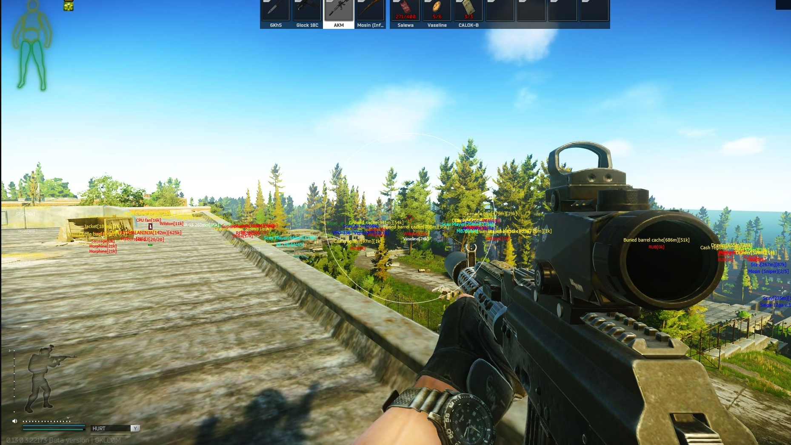
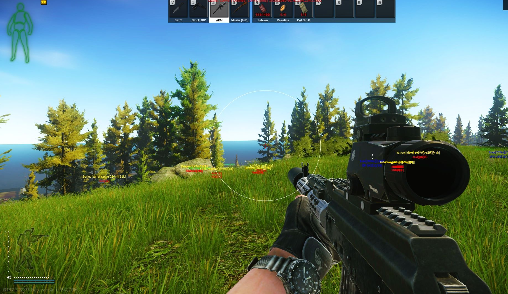
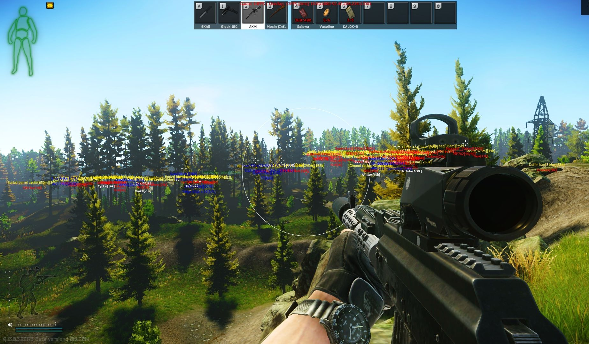

# RecodeEFT
*Outdated, Last Update On My Recode Branch Was 3 April 2023* 
Unlike LegacyEFT this version is much more organized and is a complete recode, It utilizes a whole load of objects in order to create weapon configs and extensive esp settings. Due to this, the source can be rather complicated. 
The idea was to make the most customisable system possible. In the end, it was completely overwhelming for users.  
I only worked on this for about 2 months before I got too bored to continue with this god-forsaken awful game. 

## Images:

  

  

  

## Fixes:

Include the SharpDX DLLs from [nuget](https://www.nuget.org/packages?q=Tags%3A%22SharpDX%22)  
If you're experiencing memory leaks for any mono system for the game then look at my QualityOfLife class. It enables the garbage collector which the game disables. Since its disabled you will get memory leaks creating any objects, temporary or not as you CANT dispose them unless you start using the "Using" system.

## Features:
* Esp
  * Player Esp
    * Name
    * Distance
    * Health
    * Value
    * Health Bar
    * Box
    * Chams
    * Fully Configurable Text Positions
    * Opacity Culling
  * Scav Player Esp
    * Name
    * Distance
    * Health
    * Value
    * Health Bar
    * Box
    * Chams
    * Fully Configurable Text Positions
    * Opacity Culling
  * Boss Esp
    * Name
    * Distance
    * Health
    * Health Bar
    * Box
    * Chams
    * Fully Configurable Text Positions
    * Opacity Culling
  * Scav Esp
    * Name
    * Distance
    * Health
    * Health Bar
    * Box
    * Chams
    * Fully Configurable Text Positions
    * Opacity Culling
  * Corpse Esp
    * Name
    * Distance
    * Value
    * Contents(Configurable by category, Each category has its own corpse settings)
    * Opacity Culling
    * Fully Configurable Text Positions
  * Container Esp
      * Name
      * Distance
      * Value
      * Contents(Configurable by category, Each category has its own corpse settings)
      * Opacity Culling
      * Fully Configurable Text Positions
  * Item Esp
      * Name
      * Distance
      * Value
      * Category Configuration
      * Whitelist
      * Auto Whitelist Quest Items
* Aimbot
  * Gun Category / Individual Gun Configs
  * Player Aimbot
    * Fov
    * Auto Shoot
    * Prediction
    * Legit Aimbot
    * Silent Aimbot
    * Hitscan
    * Auto Wall
  * Boss Aimbot
    * Fov
    * Auto Shoot
    * Prediction
    * Legit Aimbot
    * Silent Aimbot
    * Hitscan
    * Auto Wall
  * Scav Aimbot
    * Fov
    * Auto Shoot
    * Prediction
    * Legit Aimbot
    * Silent Aimbot
    * Hitscan
    * Auto Wall
  * Scav Player Aimbot
    * Fov
    * Auto Shoot
    * Prediction
    * Legit Aimbot
    * Silent Aimbot
    * Hitscan
    * Auto Wall
* Weapon
  * Gun Category / Individual Gun Configs
  * No Recoil Percentage
  * No Sway Percentage
  * No Malfunction Percentage
  * Fast Fire
  * Unlock All Firemodes
  * Speed Factor Amount
* Misc
  * Unlimited Stamina
  * No Inertia
  * Run And Shoot
  * Night Vision
  * Thermal Vision
  * No Visor
  * Unlock View Angles
  * Clear Weather
  * Full Bright
